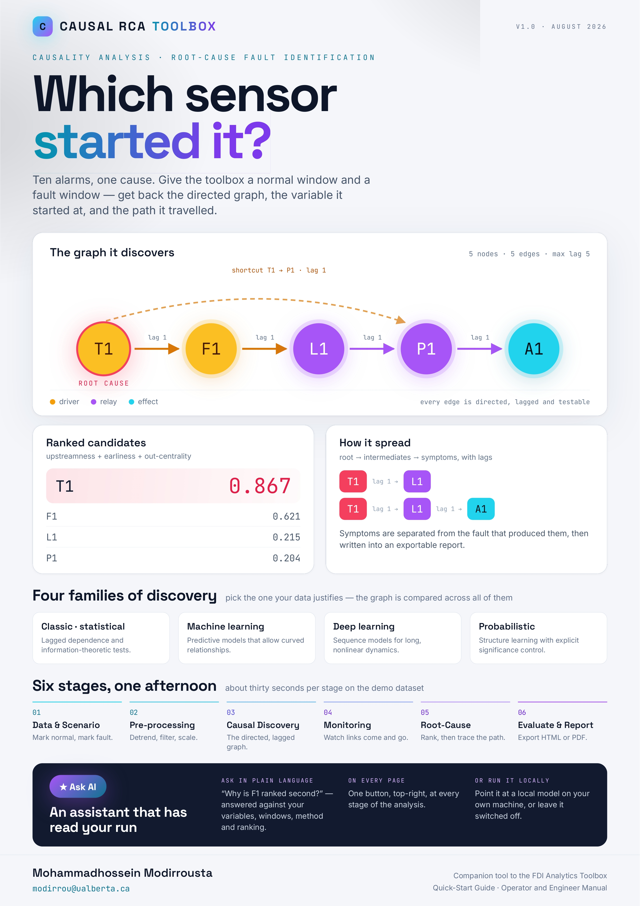
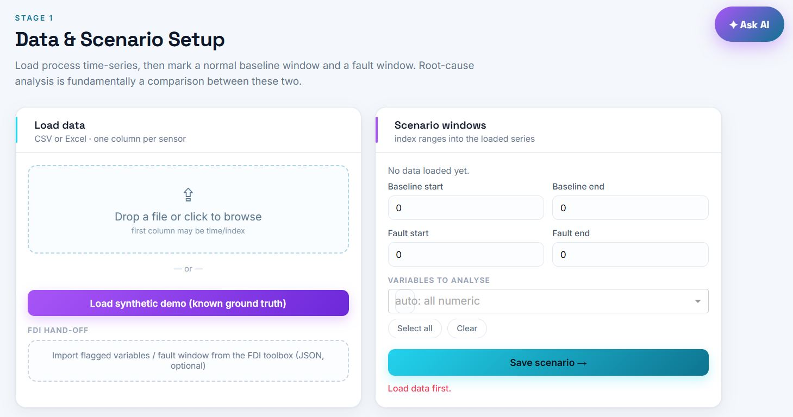
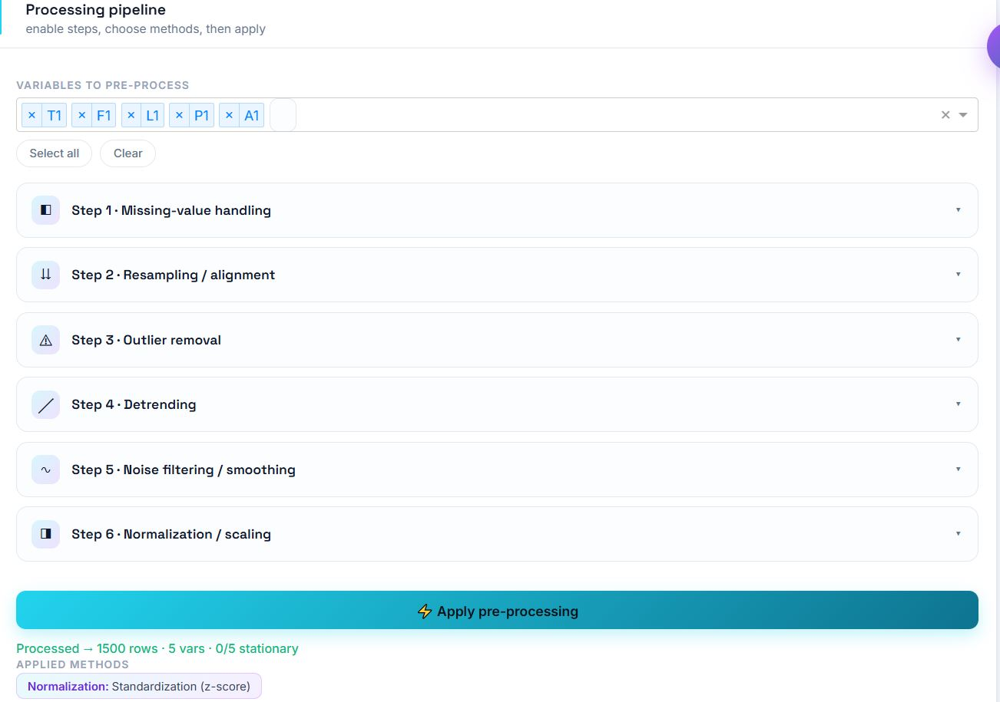
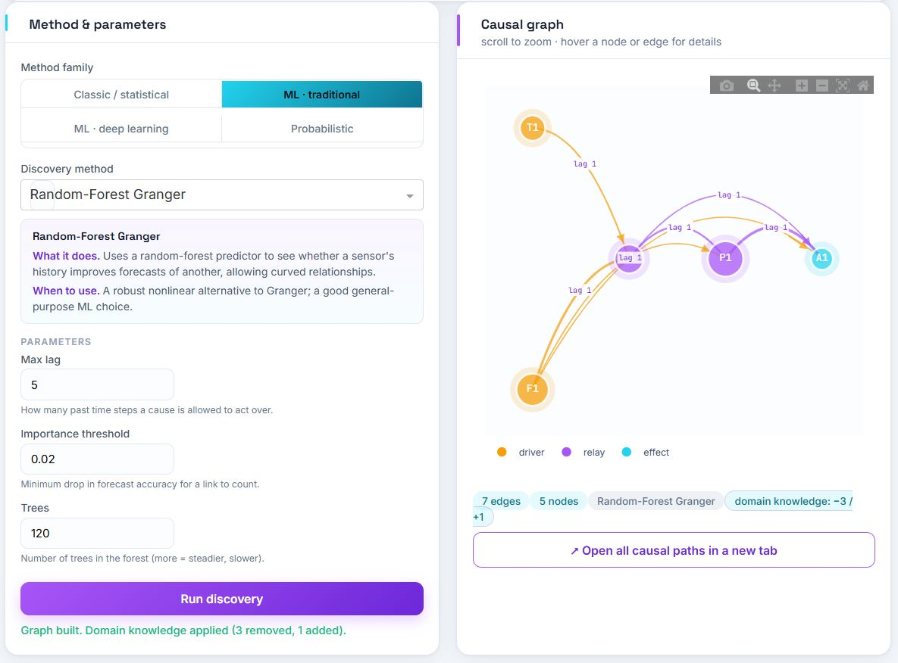
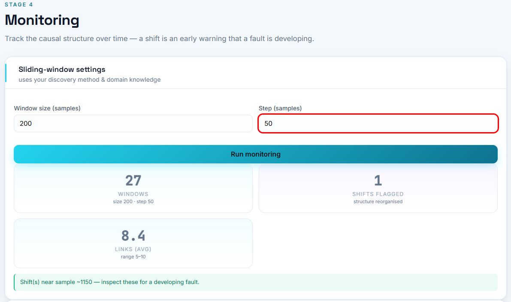
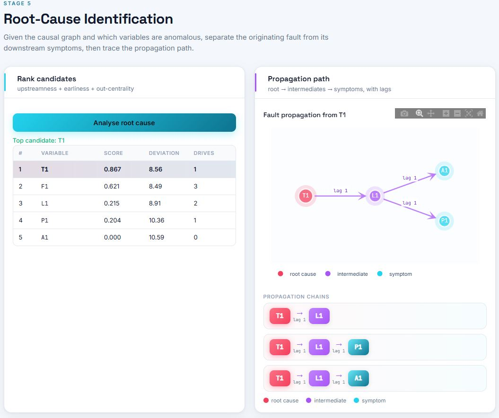
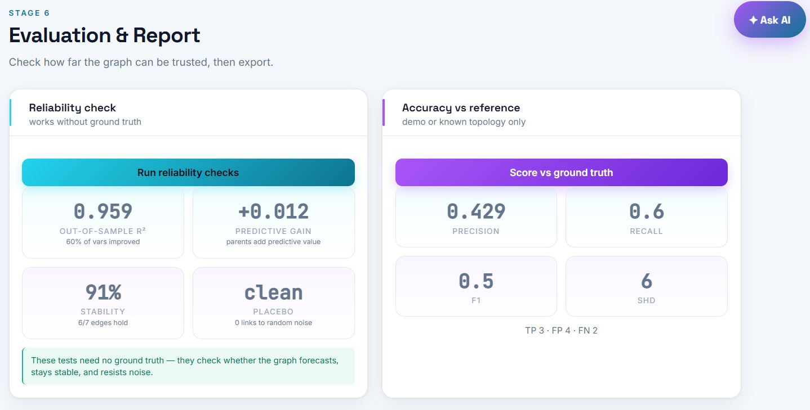
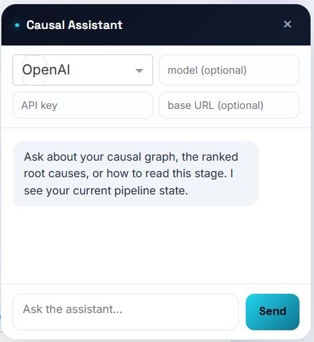

# Causal RCA Toolbox v1.0

### Causality Analysis and Root-Cause Fault Identification for Industrial Process Data

[](https://www.python.org/)
[](https://dash.plotly.com/)
[](https://scikit-learn.org/)
[](https://pytorch.org/)
[](https://causal-rca-app.azurewebsites.net)
[](#)
[](#license)

**Correlation tells you what moved together. This tells you what moved first, and why.**
Upload a CSV, walk a six-stage pipeline, and get a directed time-lagged causal graph, a ranked root-cause list, and a propagation path, all in the browser.

[**Launch App**](https://causal-rca-app.azurewebsites.net) · [**User Manual**](docs/user_manual.pdf) · [**Quick-Start Guide**](docs/quickstart.pdf) · [**Video Walkthrough**](docs/demo_video.mp4)

***

## Overview

**Causal RCA** is a no-code causality analysis toolbox for engineers and researchers working with industrial time-series data. Industrial plants generate hundreds of correlated sensor signals. When something goes wrong, many of them deviate at once, but only one is usually the origin. Correlation cannot separate the cause from its consequences; causal inference can.

The toolbox takes multivariate process data, infers a **directed, time-lagged causal graph** among the variables, and then uses that graph to identify which variable most likely *originated* a fault and how the disturbance *propagated* to everything else.

**Where this fits.** The [FDI Analytics Toolbox](https://github.com/mhmodir/FDI-Analytics-Toolbox) answers *"is there a fault, and which sensors are affected?"* This tool answers the next question: *"which sensor caused it, and how did it spread?"*

**Who is this for?**

- Process and control engineers diagnosing plant upsets, oscillations, and alarm floods
- Reliability teams separating the originating asset from downstream victims
- Researchers benchmarking causal discovery algorithms on real process data
- Students learning causal inference in an applied, visual setting

> Currently at **v1.0**. See the [Roadmap](#roadmap-version-2) for planned improvements.
> Source code is proprietary and not included in this repository. See [License](#license).

***

## Technical Poster

[](assets/poster.jpg)

***

## App Walkthrough

[](docs/demo_video.mp4)

*Click the preview above to watch the full walkthrough video*

***

## Screenshots

| Data & Scenario | Pre-processing |
| --- | --- |
| [](assets/1-1.JPG) | [](assets/2-1.JPG) |

| Causal Discovery | Structural Monitoring |
| --- | --- |
| [](assets/3-2.JPG) | [](assets/4-1.JPG) |

| Root-Cause Ranking | Evaluation & Report |
| --- | --- |
| [](assets/5-1.JPG) | [](assets/6-1.JPG) |

| AI Assistant |
| --- |
| [](assets/ai-assistant.JPG) |

***

## Table of Contents

- [Pipeline](#pipeline)
- [Features](#features)
- [Tech Stack](#tech-stack)
- [Usage](#usage)
- [Documentation](#documentation)
- [Architecture & Deployment](#architecture--deployment)
- [Roadmap, Version 2](#roadmap-version-2)
- [License](#license)

***

## Pipeline

Six sequential stages. Stages 1 to 3 build the causal graph, Stage 4 monitors it over time, Stage 5 identifies the root cause, Stage 6 validates and exports.

```
┌────────────────────┐     ┌─────────────────────┐     ┌───────────────────────┐
│ 1. Data & Scenario │  →  │ 2. Pre-processing   │  →  │ 3. Causal Discovery   │
│ Upload & fault win │     │ Stationarity & lags │     │ 19 methods, 4 families│
└────────────────────┘     └─────────────────────┘     └───────────────────────┘
                                                                    ↓
┌────────────────────┐     ┌─────────────────────┐     ┌───────────────────────┐
│ 6. Eval & Report   │  ←  │ 5. Root-Cause       │  ←  │ 4. Monitoring         │
│ Validation, export │     │ Ranking & path      │     │ Sliding-window graphs │
└────────────────────┘     └─────────────────────┘     └───────────────────────┘
```

| Stage | Description |
| --- | --- |
| **Data & Scenario** | Upload CSV/Excel or load the built-in synthetic demo process; inspect signals; mark the normal and fault windows |
| **Pre-processing** | Stationarity treatment, detrending, differencing, smoothing, scaling, and maximum-lag selection |
| **Causal Discovery** | Run any of 19 algorithms across four families under optional domain-knowledge constraints |
| **Monitoring** | Re-estimate the graph on sliding windows and flag structural change over time |
| **Root-Cause** | Score and rank candidate origins; visualise the propagation path from cause to consequence |
| **Evaluation & Report** | Reliability tests without ground truth, method comparison, plain-language summary, HTML/PDF export |

***

## Features

### Domain-Knowledge Constraints

Process knowledge is often stronger evidence than any statistic. Three constraint types can be imposed before discovery runs:

| Constraint | Effect |
| --- | --- |
| Forbidden links | Rules out physically impossible directions, such as downstream to upstream |
| Required links | Forces known couplings the data may be too short to reveal |
| Upstream tier ordering | Assigns variables to process tiers; links may only flow forward |

Constraints apply to **every** method, are stored with the resulting graph, are honoured by the reliability tests, and are listed in the exported report. In the bundled demo, differencing induces two spurious backward links; a single tier assignment removes them, lifting precision from 0.71 to 1.00 and reducing SHD from 2 to 0.

### Causal Discovery: 19 Methods, 4 Families

**Classic and statistical**

| Method | Principle |
| --- | --- |
| Conditional Granger (VAR) | Tests whether one sensor's past improves prediction of another *after accounting for all others*, so only direct links survive. **Recommended default.** |
| Pairwise Granger | The same test one pair at a time; fast, but reports many indirect links |
| Lagged cross-correlation | Peak lagged linear correlation, a quick screen only |
| Transfer entropy | Information-theoretic; captures non-linear coupling |
| PCMCI | Constraint-based, lag-resolved conditional independence testing *(requires `tigramite`)* |

**Machine learning, traditional**

Random-Forest Granger · Gradient-Boosting Granger · SVR Granger · Lasso-Granger (sparse) · Lagged mutual information · VarLiNGAM *(requires `lingam`)*

The Granger-style variants replace the linear model with a non-linear learner and measure each source's grouped permutation importance on held-out data, so they detect curved relationships that linear tests miss.

**Machine learning, deep learning** *(requires PyTorch)*

Neural Granger cMLP · Neural Granger cLSTM · Neural Granger cGRU · Convolutional TCN Granger · Temporal attention (TCDF)

Each trains a small network per target variable with a sparsity penalty on the input weights; the surviving input groups are the causal parents.

**Probabilistic**

Here each edge weight *is a probability* rather than a yes/no decision, and every link reports mean strength plus or minus one standard deviation:

- **Bootstrap edge probability**, which re-runs discovery on block-resampled copies; the weight is the fraction of resamples containing the link
- **Stability selection (Lasso)**, the selection frequency across random sub-samples
- **Bayesian regression posterior**, a probability derived from the model's own coefficient uncertainty

Links with wide uncertainty bands are drawn dashed and dimmed on the graph.

**Choosing between families**

| | Classic | ML traditional | ML deep | Probabilistic |
| --- | --- | --- | --- | --- |
| Speed | Fast | Moderate | Slow | Moderate to slow |
| Non-linear | Only TE | Yes | Yes | Partly |
| Data needed | Modest | Moderate | Large | Moderate |
| Output | Yes/no | Yes/no | Yes/no | Probability |
| Interpretability | High | Moderate | Lower | High |
| Best for | First analysis, routine use | Suspected curvature | Long records, complex dynamics | Quantified confidence |

No single method is authoritative. Running three or four from *different* families and trusting the links they agree on is the most reliable practice, because methods resting on different assumptions rarely make the same mistake. The report's method-comparison table is built for exactly this.

### Structural Monitoring

The causal graph is re-estimated on sliding windows across the record. Edge appearance, disappearance, and strength drift are tracked over time, so a change in *process structure*, not just a change in signal level, is flagged and time-stamped.

### Root-Cause Identification

Candidate origins are scored on three graph-derived factors, with baseline deviation shown as supporting context:

- **Upstreamness**, how far toward the source of the graph the variable sits
- **Earliness**, how early the variable's deviation begins relative to the others
- **Out-centrality**, how much of the network it influences downstream

The result is a ranked candidate list plus a **propagation path** plot showing how the disturbance travelled, with lag labels on every hop.

### Evaluation Without Ground Truth

Real plant data has no answer key. Four checks stand in for one:

- **Out-of-sample R²**, does the fitted structure predict held-out data?
- **Block bootstrap stability**, how often does each link survive resampling?
- **Placebo injection**, a known synthetic cause is injected; does the method find it?
- **Method comparison**, an agreement matrix across families

When ground truth *is* available, as in the synthetic demo, precision, recall, F1, and structural Hamming distance (SHD) are reported directly.

### Reporting

Every run produces a plain-language narrative summary written from the actual numbers, template-based, requiring no API key or internet access. The full report exports as self-contained **HTML** or **PDF**, including the graph, constraints, monitoring timeline, root-cause ranking, and all reliability metrics.

### AI Assistant *(optional)*

A built-in LLM assistant dock with full awareness of the current pipeline state: variables, constraints, discovered graph, monitoring flags, and root-cause ranking.

| Provider | Default Model |
| --- | --- |
| OpenAI | gpt-4o |
| Anthropic | claude-3-5-sonnet |
| Ollama (local) | llama3 |
| Custom endpoint | configurable |

The assistant is unconfigured on the public deployment; it is intended for local or self-hosted use where an endpoint is available.

### UX Highlights

- Dark sidebar with a pipeline stepper showing progress at a glance
- Causal graph and propagation plot share one visual language: glow-halo nodes, solid arrowheads, lag labels, and a left-to-right layered layout via Eades, Lin and Smyth cycle breaking
- Plain-language description on every method, parameter, and metric in the interface
- Live progress bars with a Cancel button on all long-running jobs
- Built-in synthetic demo process, so the full pipeline is explorable without uploading anything
- Works in any modern browser, no installation required for end users

***

## Tech Stack

| Layer | Library | Version |
| --- | --- | --- |
| Web framework | [Dash](https://dash.plotly.com/) | 2.17 |
| Graph rendering | [Dash Cytoscape](https://dash.plotly.com/cytoscape) · [NetworkX](https://networkx.org/) | n/a |
| Plotting | [Plotly](https://plotly.com/python/) | 5.24 |
| Data | [Pandas](https://pandas.pydata.org/) · [NumPy](https://numpy.org/) | 2.2 · 1.26 |
| Statistics | [SciPy](https://scipy.org/) · [statsmodels](https://www.statsmodels.org/) | 1.13 · 0.14 |
| Classical ML | [scikit-learn](https://scikit-learn.org/) | 1.5 |
| Causal discovery | [tigramite](https://github.com/jakobrunge/tigramite) (PCMCI) · [lingam](https://github.com/cdt15/lingam) (VarLiNGAM) | n/a |
| Deep learning | [PyTorch](https://pytorch.org/) | 2.x CPU |
| PDF export | [ReportLab](https://www.reportlab.com/) | n/a |
| Background callbacks | [diskcache](https://grantjenks.com/docs/diskcache/) via `dash[diskcache]` | n/a |
| Hosting | [Azure App Service](https://azure.microsoft.com/en-us/products/app-service) | F1 Linux |

***

## Usage

The app is accessible at **[causal-rca-app.azurewebsites.net](https://causal-rca-app.azurewebsites.net)**, with no installation or account required.

1. **Data & Scenario.** Upload your CSV/Excel file or load the synthetic demo. Inspect the signals and mark the normal and fault windows.
2. **Pre-processing.** Apply stationarity treatment and conditioning, then set the maximum lag to search.
3. **Causal Discovery.** Enter any domain constraints, pick a family and method, configure its parameters, and run. Inspect the resulting directed graph.
4. **Monitoring.** Set the window size and step, then re-estimate the graph across the record to see where structure changes.
5. **Root-Cause.** Review the ranked candidate origins and the propagation path from cause to consequence.
6. **Evaluation & Report.** Run the reliability tests, compare methods, read the auto-generated summary, and export HTML or PDF.

For a guided walkthrough, see the [Quick-Start Guide](docs/quickstart.pdf) or [Video Walkthrough](docs/demo_video.mp4).

***

## Documentation

| Document | Description |
| --- | --- |
| [User Manual](docs/user_manual.pdf) | Full operator and engineer reference. Every stage, method, parameter, and metric explained in plain language, with figures generated programmatically from real computations |
| [Quick-Start Guide](docs/quickstart.pdf) | Picture-led, one-pass walkthrough, from CSV to root-cause report in a single session |
| [Video Walkthrough](docs/demo_video.mp4) | End-to-end case study on the demo process |
| [Technical Poster](assets/poster.jpg) | One-page summary of the method and results |

Every figure and every quoted number in the manual is reproducible: the documentation is built against a miniature re-implementation of the pipeline, so the text and the software cannot drift apart.

***

## Architecture & Deployment

### Technology Stack

The application is built entirely in Python. Frontend and backend are unified in a single Dash application, where Dash renders the UI as React components in the browser while the Python backend handles data processing, causal inference, and callback logic. Styling uses a custom CSS stylesheet with a cyan and violet design system (cyan for data and signal, violet for AI and inference) and CSS variables for theming.

```
Browser (React / Plotly / Cytoscape)
        ↕  HTTP
Python backend (Dash + Flask)
        ↕
NumPy · SciPy · statsmodels · scikit-learn · tigramite · lingam · PyTorch
        ↕
diskcache  ←  background callbacks (progress bars, Cancel button)
```

### Cloud Deployment on Microsoft Azure

The live app is hosted on **Azure App Service** in the `canadacentral` region. Key decisions made during deployment:

- **Single instance only.** The diskcache background-callback system stores job state on local disk, which is incompatible with horizontal scaling. App Service was chosen over Container Apps, which autoscales by default, for this reason.
- **CPU-only PyTorch.** `requirements.txt` begins with `--extra-index-url https://download.pytorch.org/whl/cpu`, which pulls the 200 MB CPU wheel instead of the 2 GB CUDA build. All 19 methods, including the five deep-learning engines, fit within the F1 tier as a result.
- **Gunicorn** serves the app with `--workers=1` to maintain diskcache compatibility and `--timeout=1200` to accommodate long-running discovery and training jobs.
- **Cache path** is configurable via the `CACHE_DIR` environment variable, defaulting to system temp when `WEBSITE_INSTANCE_ID` indicates an Azure environment.

The deep-learning engines are usable on the free tier but are slow under its memory ceiling. For heavy neural-Granger work, running locally on a GPU machine is considerably faster.

***

## Roadmap, Version 2

- **Non-stationary regimes.** Automatic segmentation and per-regime graph estimation instead of a single global structure
- **Execution speed.** Parallelised discovery and incremental re-estimation for the sliding-window monitor
- **Richer constraint entry.** Import process topology from P&ID or tag-hierarchy files rather than manual entry
- **Alarm integration.** Combine alarm sequences with the inferred graph to explain alarm floods
- **Tighter FDI coupling.** Consume detection output from the FDI Analytics Toolbox directly as the fault window
- **Interventional analysis.** Simulate holding a variable constant, using the fitted structure

***

## License

© 2026 Mohammad Modirrousta. All rights reserved.

This repository contains documentation and project resources only. The application source code is proprietary and not included here. No part of the source code may be reproduced, distributed, or used without explicit written permission from the author.

For collaboration or licensing enquiries, contact via [GitHub](https://github.com/mhmodir).

***

Built with [Dash](https://dash.plotly.com/) · Hosted on [Azure App Service](https://azure.microsoft.com/en-us/products/app-service)

**[github.com/mhmodir](https://github.com/mhmodir)**
